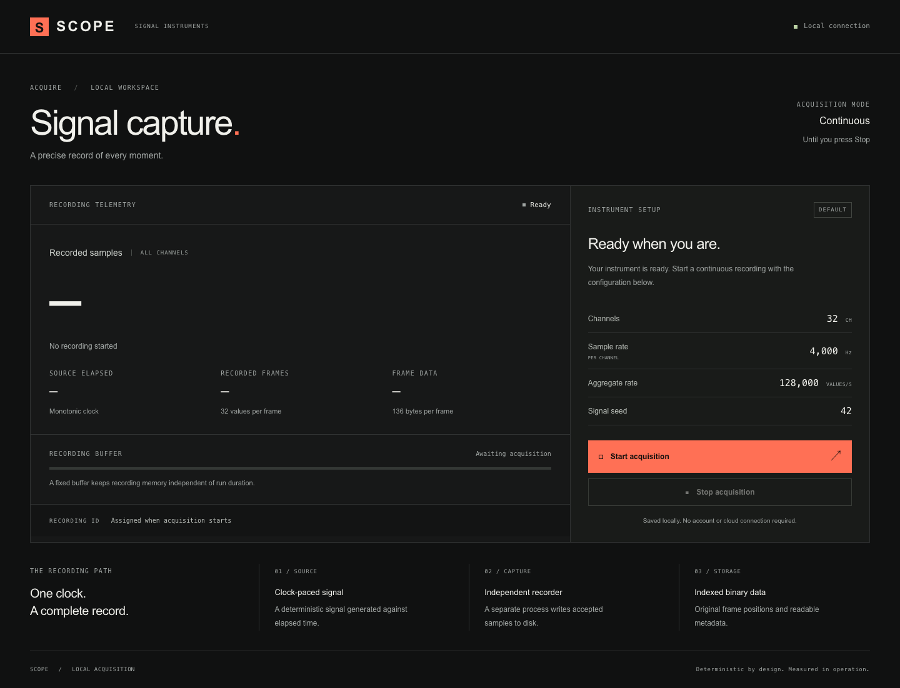
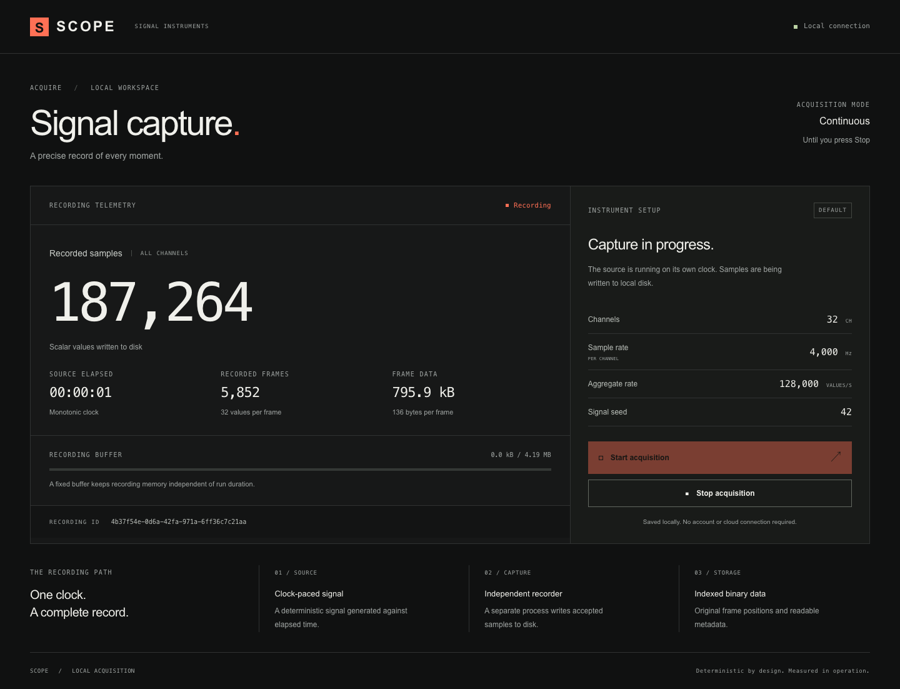
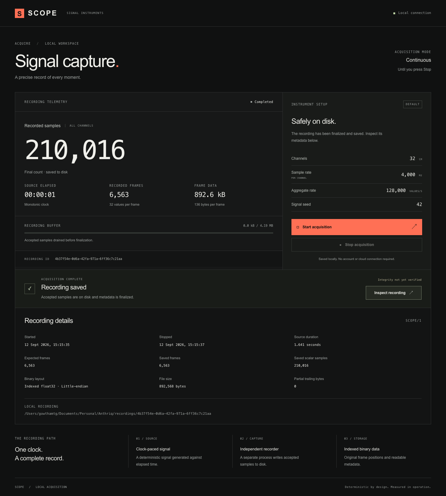
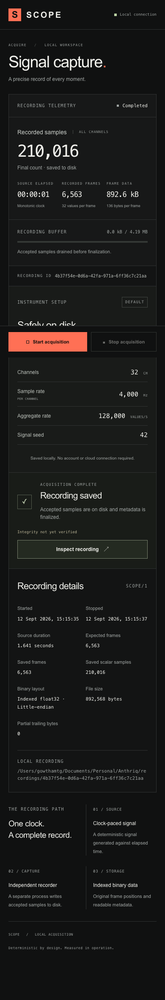

# T01 validation evidence

Local environment: macOS 26.6.2, Apple Silicon (arm64), Node.js 24.21.0, npm 11.19.0. Checks performed September 12, 2026. Only this local platform is claimed here; the GitHub Actions run supplies separate Ubuntu evidence.

## Completed checks

- Three core tests passed: exact two-second nominal acquisition; continuous-capture interrupt with process cleanup; recording startup failure without false completion.
- The nominal run produced 8,000 frames, 256,000 scalar values, 1,088,000 bytes, and zero partial bytes. Its existing streaming validator reported PASS with zero missing, duplicated, or incorrect values.
- A literal float32 reference was independently calculated from the specification: frame 0, channel 0, seed 42 at 4,000 Hz is `-0.7823104858398438`, encoded little-endian as `80 45 48 bf`.
- Four production-browser tests passed: capture/reload/stop/inspect; a visible startup failure; concurrent starts and rapid repeated stops; mobile controls and keyboard capture.
- The production Next.js build passed. The three runtime dependencies are pinned Next.js, React, and React DOM. TypeScript, Tailwind/PostCSS, type definitions, and Playwright are development dependencies. Strict type checking covers the active T01 application and acquisition path.
- Desktop (1440 px) and mobile (390 px) screens were reviewed using actual acquisition data. The capture produced no browser page errors. At 390 px the document width was 390 px, with no horizontal overflow.

## Visual evidence

These screenshots show a short manual acquisition, so their counts differ from the exact two-second automated fixture. Completion is explicitly labeled as not yet integrity-verified in the UI.

## Limits

The short checks establish T01 behavior, not sustained losslessness, hard real-time scheduling, exhaustive corruption detection, or arbitrary failure recovery. Those claims require the later tickets and one-hour evidence run. Reproduce the checks using the commands in the root README.
