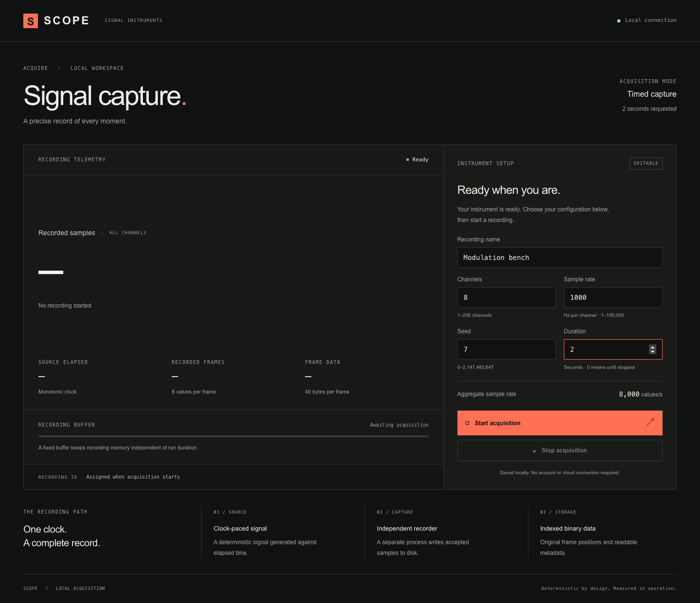
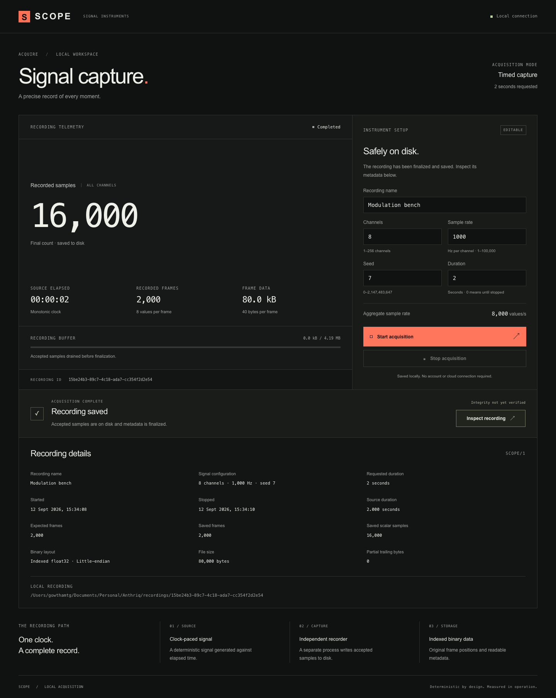
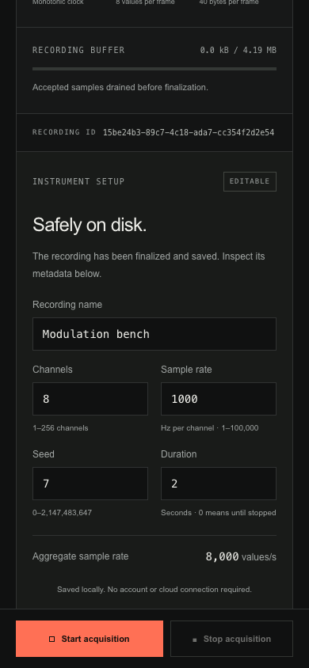

# T02 configuration evidence

Local checks: macOS 26.6.2, arm64, Node.js 24.21.0, npm 11.19.0, September 12, 2026. The PR's GitHub Actions run records clean-checkout Ubuntu results separately.

## Automated behavior

Eight Node core tests passed, including the three T01 checks and five configuration checks:

- Unknown CLI settings fail before a recording directory is created.
- Missing option values fail with a specific error.
- Out-of-range settings, fractional integer settings, nonfinite/empty values, and unsafe durations are rejected before allocation.
- Two real nondefault captures preserve settings, display name, exact timed extent, and independently checked float32 observations.
- Unknown waveform versions fail inspection and verification explicitly.

| Configuration | Duration | Expected/recorded frames | Scalar values | Frame-data bytes |
| --- | --- | --- | --- | --- |
| 32 channels, 4000 Hz, seed 42 | 2 s | 8000 | 256000 | 1088000 |
| 8 channels, 1000 Hz, seed 7 | 0.5 s | 500 | 4000 | 20000 |
| 3 channels, 200 Hz, seed 123 | 0.25 s | 50 | 150 | 1000 |

All three captures passed the existing nominal verification path. The tests compare four nondefault stored values with the independently calculated literals published in [the waveform reference](../../waveform.md), in addition to the T01 default reference.

Six production Chromium tests passed: the original four capture/lifecycle/mobile checks, rejection of invalid service settings without changing current acquisition state, and timed configuration with field-error correction, reload, automatic completion, and saved-setting inspection. The timed browser fixture captures 3 channels × 200 Hz × 2 seconds = 1200 scalar values.

Strict TypeScript checking and the production build passed. No new dependencies were introduced for T02.

## Visual evidence

The screenshots show an additional actual 8-channel, 1000 Hz, seed 7, two-second run named “Modulation bench”: 2000 frames and 16000 scalar values. No page errors or mobile horizontal overflow were observed; the narrow document width was 390 px.

## Limits

Numeric input bounds are not lossless-throughput promises. These short runs do not establish sustained performance, exhaustive overload handling, or corruption recovery. The recordings library, fault/overload demonstrations, traces, retrieval/playback/verification UI, and one-hour benchmark remain later tickets. The parent specification is unchanged.
