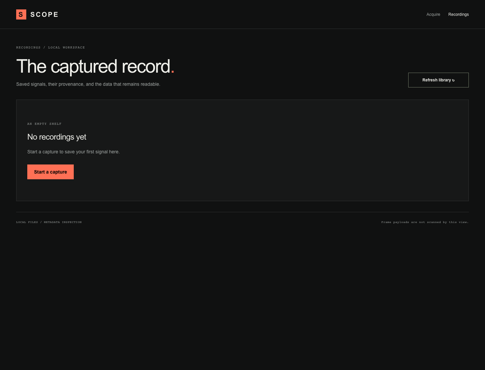
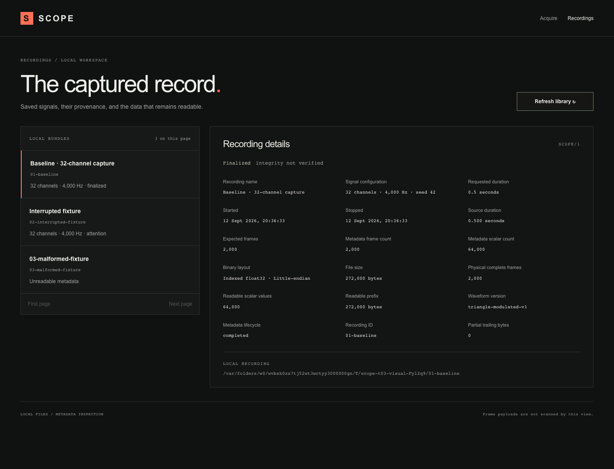
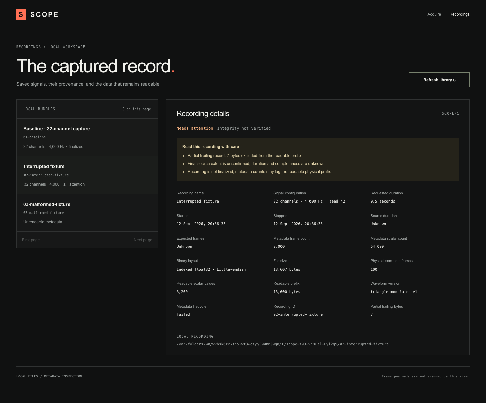
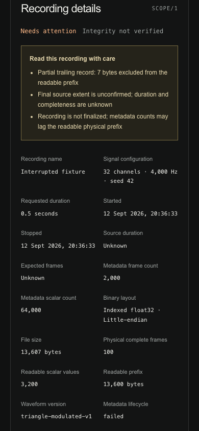

# T03 library and inspection evidence

Local environment: macOS arm64, Node.js 24.21.0, September 12, 2026. The implementation PR links a
separate clean-checkout Ubuntu CI result.

## Checks

- Strict TypeScript checking and production build passed.
- Thirteen core tests passed: the existing eight capture/configuration checks plus truncated-prefix
  inspection, unknown duration for unconfirmed extent, rejection of invalid metadata
  types/version/layout/counts, empty/paginated CLI libraries including malformed entries, and
  contradiction/oversized-metadata handling.
- Eight production Chromium tests passed (including an assertion of the desktop library/detail
  layout): the existing six workflows plus an empty library and a paginated eleven-bundle library
  covering normal, truncated/unconfirmed, malformed, and missing recordings. Selection survives
  reload; an invalid selection clears the previous details.
- The truncated browser fixture retains two complete 136-byte frames and three partial bytes. The UI
  reports two physical frames, excludes the tail, and displays unknown duration despite a stale
  metadata duration.
- No frame payload is read for listing/inspection: the implementation reads bounded metadata and
  filesystem stat only. Directory-name scanning retains at most page-size+1 candidates; default page
  size is ten and maximum is fifty. This is bounded memory, not constant listing time.

## Screenshots

The normal screenshot is a real 0.5-second default acquisition (2,000 frames, 64,000 scalar values).
The visual interrupted fixture has 100 complete frames plus seven partial bytes; it differs from the
smaller automated fixture. The interrupted and malformed examples are deliberately modified
disposable copies, clearly named as fixtures. No existing user recording was modified.

## Limits

Metadata-only inspection does not verify sample values, index ordering, or sustained losslessness.
Physical readable prefix means complete-sized records, not proven correct observations. Current
finalization is distinct from integrity verification. Comprehensive process/disk faults remain T04;
verification and playback drafts retain their later acceptance work. The parent specification is
unchanged.
