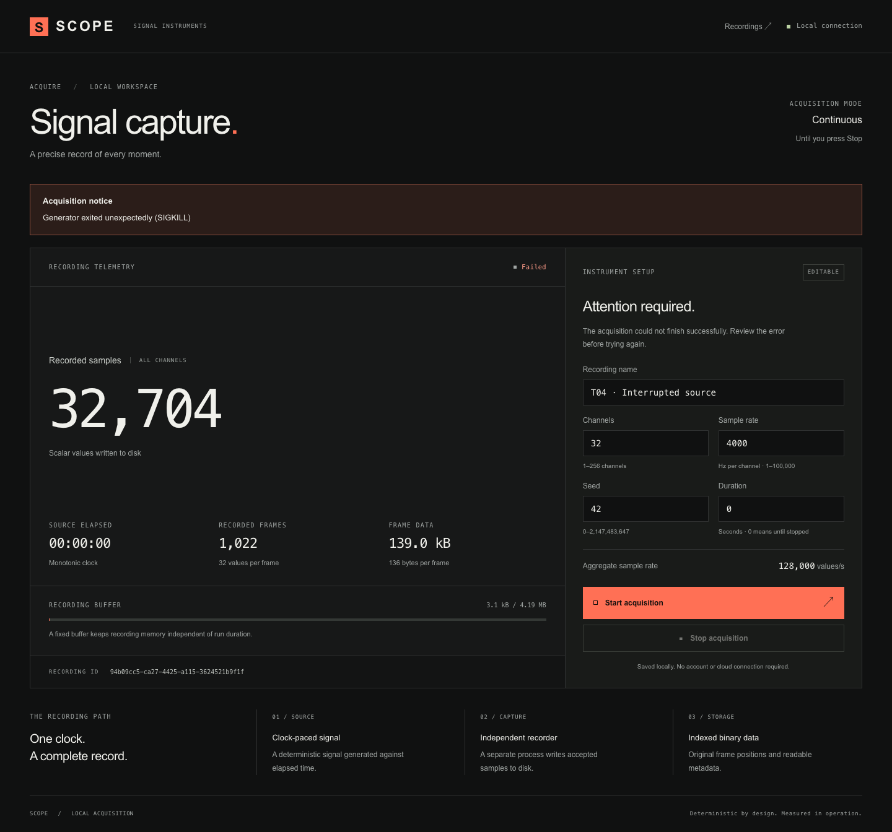
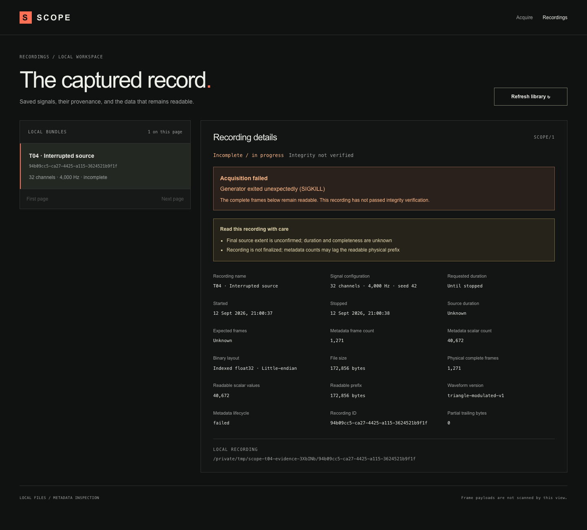

# T04 — safe stops and explicit failures

Scope: [issue #5](https://github.com/GowthamTG/anthriq/issues/5). Behavior and limitations:
[failure handling](../../failure-handling.md). The parent specification is unchanged.

Local validation on macOS with Node.js 24:

- Strict TypeScript and production Webpack build passed.
- All 23 core checks passed across the full-suite run and the final focused timeout addition: the
  original 13 checks plus 10 real-process failure/write checks.
- All 12 production Chromium checks passed, including suspended-recorder Stop timeout, timed drain
  state, saved failure cause, and application SIGTERM cleanup.
- Default two-second acquisition still gives exactly 8,000 frames, 256,000 scalar samples, and
  1,088,000 frame-data bytes, with the independent float32 reference unchanged.
- Controlled ENOSPC leaves 141 bytes: one readable 136-byte frame and a flagged five-byte partial
  tail. Short writes preserve exact extent and observations.
- A timed drain exceeding ten seconds fails with its known 400-frame extent retained; CLI
  verification returns FAIL. A suspended-recorder Stop fails with unknown extent and no surviving
  owned processes.

The regression loop reproduced stale “recording” metadata after recorder death, indefinite browser
Stop, missing stopping state during timed drain, a suspended orphan holding inherited handles, and
absent failure-cause display. These now have automated coverage.

The test-only I/O preload simulates selected OS failures against real files. It does not prove
behavior on actual exhausted hardware, power loss, Windows, or sustained one-hour acquisition.
Ubuntu clean-install CI is required before merging.

Screenshots come from a real production capture whose generator was terminated; no traces, counts or
failure states were fabricated. The saved inspection layout was also checked at 390px without
horizontal overflow.

