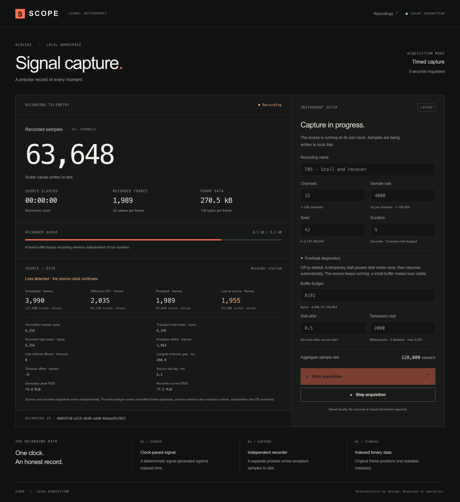
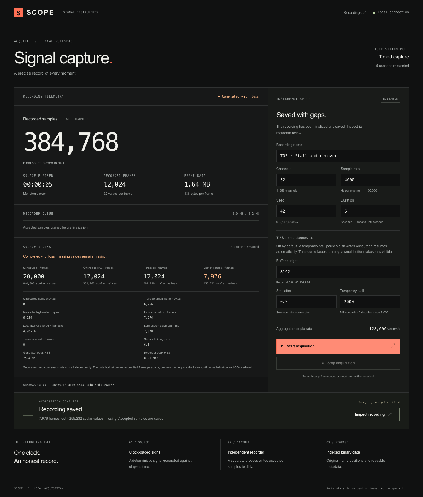

# T05 — bounded overload and recovery

Scope: [issue #6](https://github.com/GowthamTG/anthriq/issues/6). Reproduction and counter
definitions: [overload behavior](../../overload.md). The parent specification is unchanged.

Local macOS / Node.js 24 validation: strict TypeScript, production build, 26 core checks and 13
production Chromium checks passed. Real-process tests compare saved frame identities with every
logged missing interval, reconcile source/recorder totals, check sample-byte high-water marks,
observe stopped emission during a temporary stall and resumed throughput afterward, and account for
trailing loss. The default two-second test still requires exactly 8,000 frames and zero loss.

The real five-second screenshot capture used 32 channels, 4,000 frames/s, an 8,192-byte budget and a
two-second recorder stall after 0.5 seconds. It finalized 12,024 frames and declared 7,976 lost
frames, totaling the independent 20,000-frame extent. Source and recorder payload high-water marks
were both 6,256 bytes. The final observed offer rate recovered to about 4,005 frames/s. These
observed values are not fixed expectations: scheduling affects exact losses. The
[saved observation summary](observed-summary.json) contains the measurements.

No browser page errors occurred; the expanded screen also passed a 390px horizontal-overflow check.
Screenshots show real measurements, not fabricated traces. The byte budget excludes runtime,
serialization and OS overhead; RSS is measured separately. These short tests do not establish
one-hour reliability, power-loss durability, hardware-specific throughput or Windows support. Clean
Ubuntu CI is required before merge; its final result is recorded on the PR.

[Narrow-screen capture](narrow.png)
