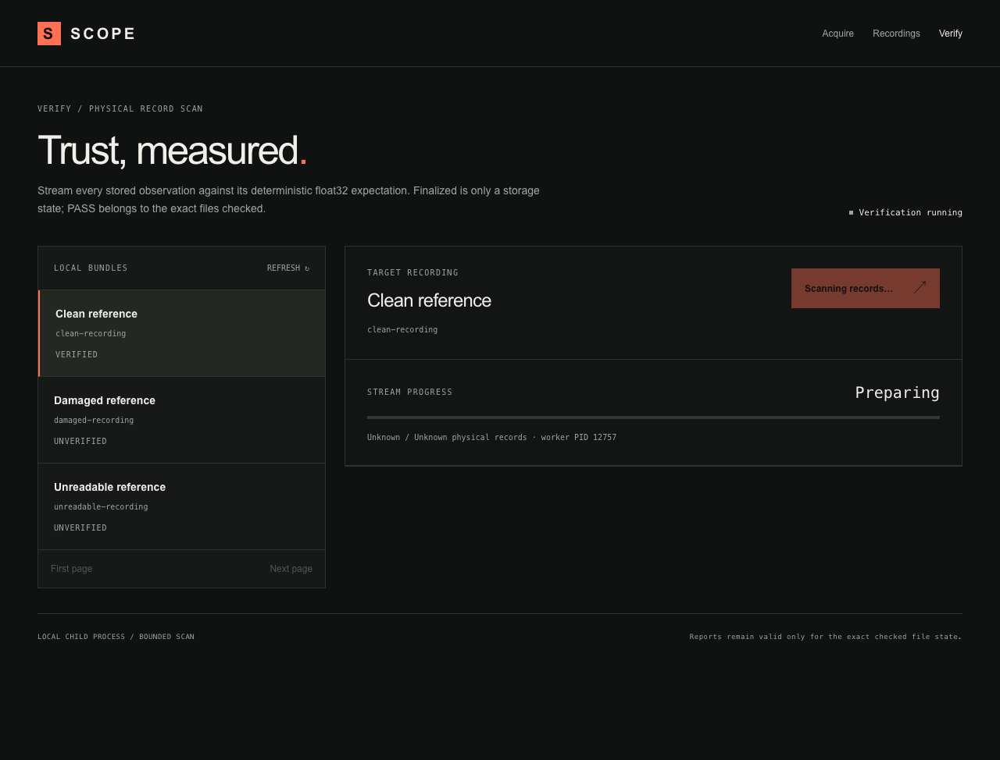
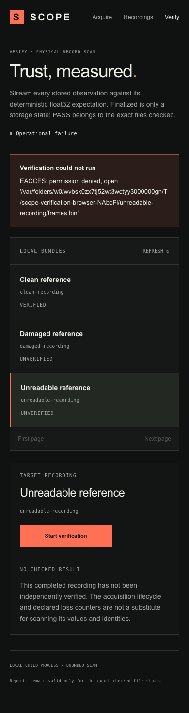

# T06 — independent recording verification

Scope: [issue #7](https://github.com/GowthamTG/anthriq/issues/7). Report and staleness contract: [recording format](../../recording-format.md). The parent specification and recording format are unchanged.

## Automated behavior

- Strict TypeScript and the production Next.js build pass. The full suites pass with 39 core tests and 16 production Chromium tests.
- The core suite includes hand-authored `SCOPE/1` binary fixtures whose literal float32 observations do not import the production encoder or signal function.
- Verification checks a clean PASS; initial, interior, and trailing loss; adjacent duplicates; wrong-valued duplicates; finite and nonfinite incorrect values; combined overlapping classes; partial records; invalid metadata/version/layout/lifecycle/counts/duration; unsafe, out-of-extent, and decreasing identities; exit codes; persistence failure; and stale results.
- Production Chromium coverage verifies a separate worker PID, one-job conflict, responsive application state during checking, PASS, integrity failure, operational failure, report download, and a 390 px layout.
- All earlier nominal, configuration, inspection, shutdown/failure, and overload/recovery checks remain in the full regression suites.

## Measured short verification

Local macOS / Apple Silicon / Node.js 24 measurement on September 13, 2026: a fresh 3-channel, 200-frame/second, seed-123, 0.25-second acquisition produced 50 frames, 150 scalar observations, and 1,000 frame bytes. Its persisted `SCOPE-VERIFICATION/1` report scanned all 50 records/1,000 bytes in 1 ms and returned PASS with zero missing, duplicated, incorrect, or format errors. The dedicated short-lived CLI verifier reported approximately 90 MB RSS; this is process memory, not the 64 KiB read buffer.

## Visual evidence

The screenshots use actual production-browser verification state and reports. They are not precomputed display fixtures.

## Limits

These short fixtures establish classification, isolation, persistence, and staleness behavior, not sustained performance. The one-hour default recording and long-file verification timing/memory evidence remain T15/T16. File identity detects ordinary replacement, size, and modification changes; it is not a cryptographic signature or protection against deliberate coordinated tampering. T07 adds the visible disposable corruption demonstration and never mutates user recordings.
