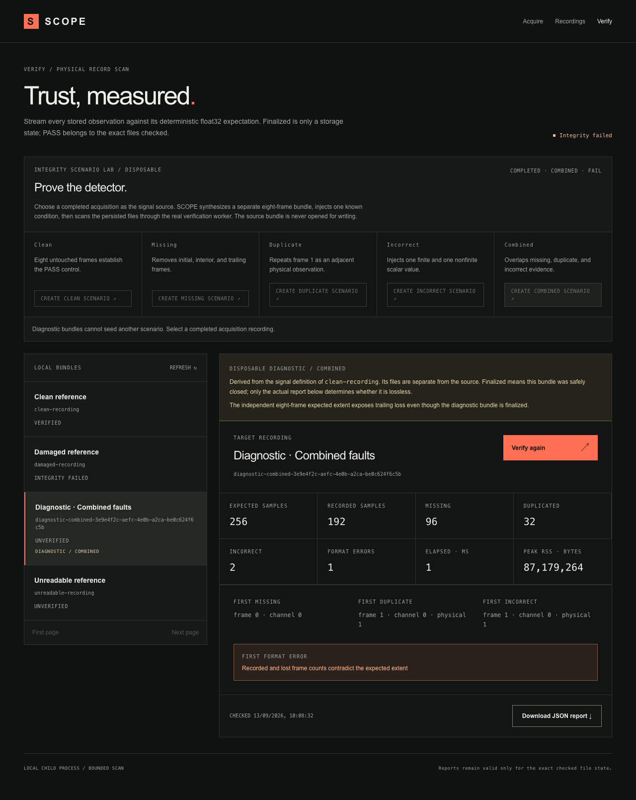
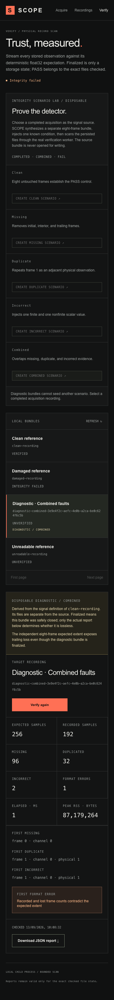

# T07 — disposable integrity scenarios

Scope: [issue #8](https://github.com/GowthamTG/anthriq/issues/8). Diagnostic provenance and service behavior: [recording format](../../recording-format.md). The parent specification and verifier semantics are unchanged.

## Automated behavior

- Strict TypeScript and the production Next.js build pass. The full suites pass with 46 core tests and 17 production Chromium tests.
- Core integration tests create all five production diagnostic scenarios from real completed sources, run their persisted files through `verifyRecording`, and assert exact literal counts and first positions.
- Clean passes. Missing covers initial, interior, and trailing loss. Duplicate counts every channel in the repeated frame. Incorrect includes finite and nonfinite values. Combined retains all three overlapping discrepancy classes.
- Input, provenance-version, diagnostic-chaining, uniqueness, atomic-directory, and source-lifecycle behavior are checked without importing test fixtures into production.
- The production browser creates and verifies a Combined scenario, downloads its report, and byte-compares the source `metadata.json`, `frames.bin`, and `verification.json` before and after creation.

## Visible demonstration

The screenshots use actual production-browser state. With a 32-channel source, Combined reports 96 missing samples, 32 duplicated samples, and two incorrect samples. Its first positions are frame 0/channel 0 for missing and frame 1/channel 0/physical ordinal 1 for both duplicate and incorrect. The additional format error is the genuine count contradiction caused by an extra physical observation.

## Limits

Diagnostic recordings contain only eight expected frames and establish classification, isolation, persistence, and walkthrough behavior—not sustained verification performance. They reuse the source signal definition but do not read its frame payload and do not establish the source's integrity. Bundles persist until removed manually. T07 adds no general editor, deletion workflow, corruption repair, or automatic cleanup.
