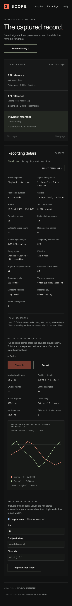
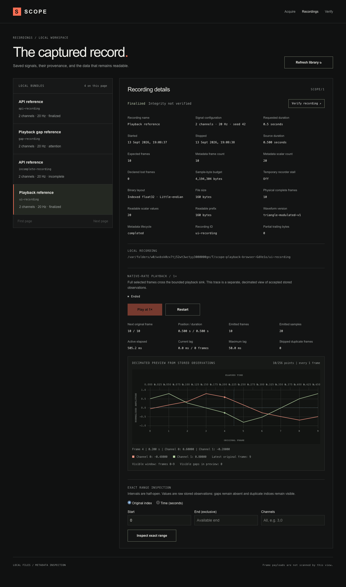
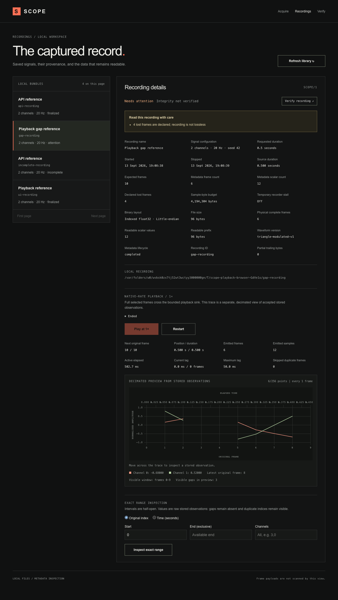
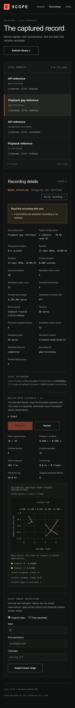

# T10 — native-rate playback evidence

Scope: [issue #11](https://github.com/GowthamTG/anthriq/issues/11). Playback uses the stored
original frame indices and the recording's confirmed sample rate; it does not regenerate display
values from the waveform definition.

## Automated behavior

- The public playback sink receives the complete selected frame sequence. A real-clock fixture emits
  eight frames at 40 Hz, records active elapsed time, and verifies that output spans the native
  interval instead of arriving as an immediate file read.
- Initial, interior, and trailing gaps retain their timeline duration. Adjacent duplicate
  observations emit once and increment the skipped-duplicate count. The final available frame emits
  once, repeated Play at end is inert, and Restart returns to paused position zero.
- A delayed asynchronous sink produces measured lag while still receiving every frame. A rejected
  batch produces Error without advancing emitted counts or position.
- Session tests prove that opening the same recording is idempotent, opening another recording
  drains and closes the previous reader, and a failed replacement leaves the valid session intact.
- HTTP coverage checks exact action bodies, missing/finalization failures, session conflicts, and
  snapshots. The production Chromium workflow opens paused, plays real data to Ended, verifies
  bounded preview and counts, checks non-looping Play, and restarts to paused zero.
- The CLI uses the same interface: optional JSON-lines output awaits stdout backpressure and final
  metrics are written separately to stderr.

## Visible demonstration

The screenshots are captured from the production recording-detail route after ten two-channel frames
have crossed the full-data sink at 20 Hz. The trace is the bounded decimated browser view; the
adjacent counters are the engine's actual output and timing state.

The follow-up chart uses pinned `uplot@1.6.32` behind a dynamically loaded client module. Original
frame and elapsed-time axes share the source index scale, normalized amplitude remains fixed at
`[-1, 1]`, and the cursor reports exact stored values. Null observations inserted only in the
chart's aligned data break lines across visible missing intervals. The gapped fixture retains frames
`1, 2, 5, 6, 7, 8` from an expected extent of ten and reports its initial, interior, and trailing
preview gaps separately from recorded-loss counters.

The production webpack build emits uPlot as a 50,747-byte minified lazy chunk and the signal-trace
module as a separate 5,397-byte minified lazy chunk. Together they are 24,142 bytes when measured
with gzip. uPlot's dynamically loaded stylesheet is 1,620 bytes minified and 711 bytes with gzip.
The static acquisition page does not import these assets. The complete Chromium suite passes 21
workflows, including cursor values, bounded snapshots, explicit restart, in-page recording
replacement, gap presentation, and the 390-pixel layout.

## Bounds and limits

Full-data batches contain at most 256 frames and target at most 64 KiB. One scheduler turn examines
at most 4,096 physical observations. Browser state retains at most 256 decimated observations for
the first four channels and is coalesced through the existing SSE stream; full-rate frames are not
copied into React state. The visualization creates one uPlot instance per channel/rate
configuration, coalesces data paints with `requestAnimationFrame`, resizes through `ResizeObserver`,
and destroys all of those resources when the recording changes or the view unmounts. These checks
establish short-run correctness and measured native pacing, not the long-recording measurements
scheduled for T16. Pause, seek, speed, and channel controls remain T11.
