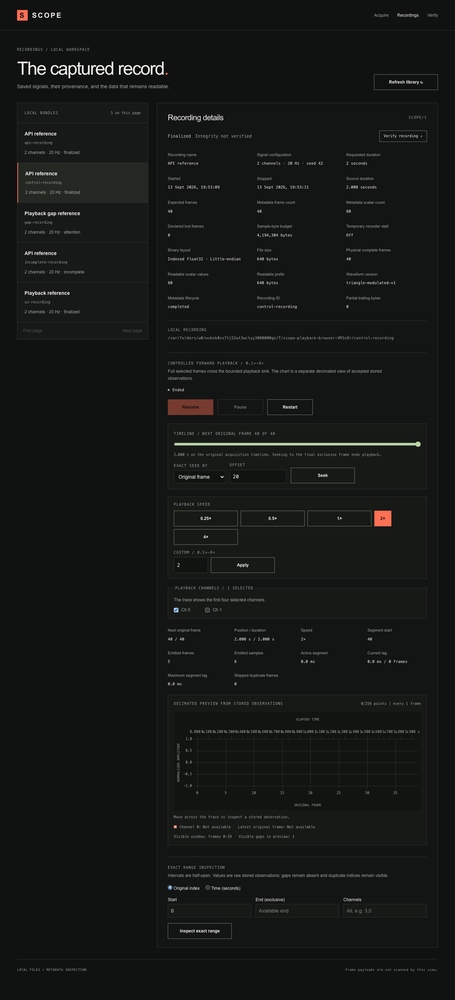

# T11 — precise playback controls

Scope: [issue #12](https://github.com/GowthamTG/anthriq/issues/12). This evidence covers the public
playback control contract layered on the native-rate engine from T10.

## Automated behavior

- A gated asynchronous sink proves that Pause does not acknowledge until an already accepted output
  batch has committed its position; once paused, no more frames emit until Resume.
- A seek requested while an older sink batch is pending waits for that boundary, then opens a new
  reader at the requested position. No frame from the former reader appears after seek
  acknowledgement.
- Exact index seeks work while paused and playing; time seeks use `ceil(seconds × sampleRate)`. Zero
  and the exclusive final expected extent are valid positions; the latter leaves playback ended.
- Speed accepts only finite values from 0.1× through 8×. The core covers a 2× paced replay and the
  browser workflow covers the required 0.25× preset and custom 2× control.
- Channel changes recreate the selected reader at the same next position, retain selected order,
  clear the bounded preview, and preserve the recording itself.
- HTTP coverage rejects unsupported keys, ambiguous seek bodies, and invalid speed without changing
  the active session. Chromium coverage exercises Pause/Resume, exact seek, the timeline, speed,
  channel selection, end state, and a 390-pixel layout.

## Cost and bounds

Each seek calls the indexed reader's lower-bound lookup: O(log N) physical-index probes followed by
only the matching sequential read chunks, each targeting at most 64 KiB. It never scans the full
recording merely to relocate playback. Full sink batches remain capped at 256 frames and about 64
KiB; the browser retains no more than 256 decimated observations from the first four selected
channels.

Short fixtures establish transition correctness, not long-recording performance. T16 owns sustained
seek and paced-playback measurements on the recorded long acquisition.

